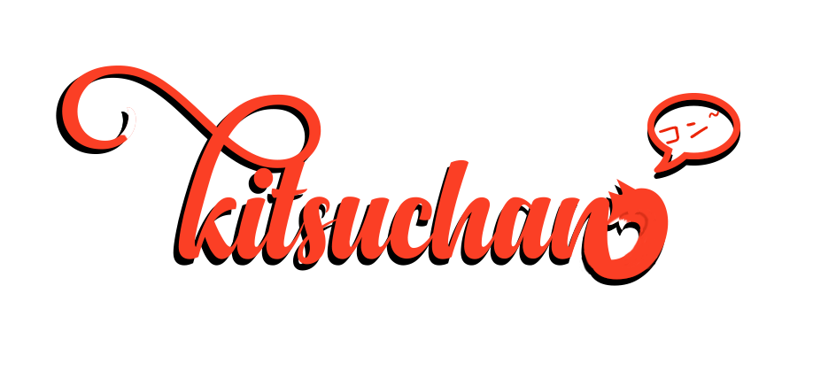

[](https://github.com/n303p4/Kitsuchan-NG/blob/master/LICENSE.txt)
[](https://python.org/)
[](https://codeclimate.com/github/ClaraIO/kitsuchan) [](https://circleci.com/gh/ClarityMoe/kitsuchan)

```py
from k3 import commands

@commands.command()
async def hello(ctx):
    await ctx.send("Hello k3!")
```

**kitsuchan 3** (or **k3** for short) is a very early, very WIP command handler and bot framework
written in Python. Unlike [Amethyst](https://github.com/ClaraIO/Amethyst), the other Clara Python
bot, it is not a Discord bot - instead, it is meant to be used with any chat protocol of your
choosing. As long as you can find (or make) a decent async wrapper for your protocol in Python,
you can make a k3 bot out of it with little difficulty. This "protocol-agnostic" approach means
that you don't have to rewrite any of your commands if you decide to port your bot to another
chat client, such as Twitch or IRC.

The downside to this approach is that k3 is not as in-depth as other bot frameworks, at least not
yet. While it will work with essentially any chat protocol, it also lacks features specific to any
of them in particular. This makes it unsuitable for bots that rely on heavy protocol integration,
such as moderation bots and music bots. Abstractions may help alleviate this in the future.

## How do I run k3?

### Short answer

`git clone` and then:

* Minimal: `python3 -m pip install --user .`
* With `aiohttp` support: `python3 -m pip install --user .[http]`
* With dependencies for modules: `python3 -m pip install --user .[full]`
* With Discord support: `python3 -m pip install --user .[discord]`

### Longer answer

Strictly speaking, you don't "run" k3 by itself. It's a command handler, not a complete bot.
Obviously, though, there are a couple of simple bots in the repository that use the k3 handler.
We'll get into those in a moment.

k3 itself requires Python 3.6 or higher. `aiohttp` is also strongly recommended, since it can be
used for API requests, but it is not strictly required. However, many of the included modules
will not work without it. Chances are that the wrapper you use for making your own bot will have
`aiohttp` as a dependency, anyway.

`text_bot.py` is a simple demonstration of the command handler, and will work out of the box
without any special configuration. You can simply run it in a command line, or in IDLE, or in
whichever environment you prefer. This is not a useful bot in any way, but it does illustrate the
portability of k3.

There are two Discord bots, `discord_bot.py` (written for `discord.py` `1.0`) and
`discord_bot_legacy.py` (written for `discord.py` `0.16`). Use whichever one corresponds to your
installed discord.py version. `config.example.json` contains a sample config that will work
with either of these bots. Rename it to `config.json` and fill it out appropriately.

## It's not running! I get a syntax error!

Do you see that "Python 3.6 or higher" requirement above? That is a requirement, not just a
suggestion. ;)

## If this is k3, where are k1 and k2?

You can find them in [a separate repository](https://github.com/n303p4/kitsuchan-legacy). k1 is
no longer maintained, so it is not recommended that you use it. k2 continues to receive updates;
however, development has slowed down to focus on k3.

## License

See `LICENSE` for details on that.
